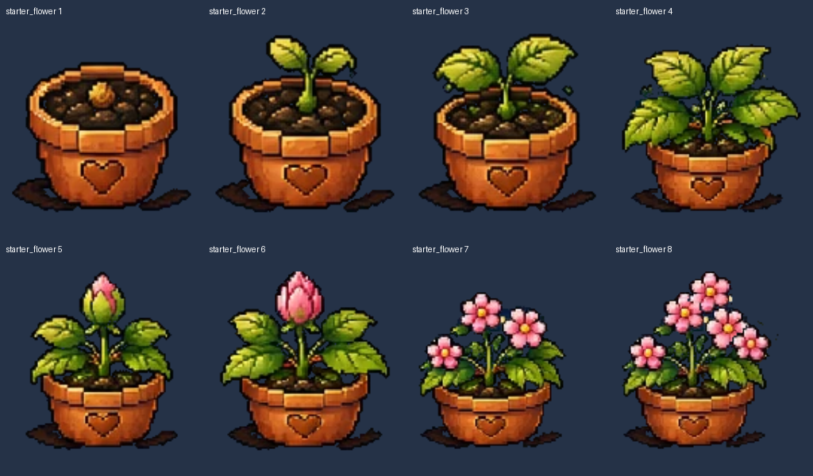
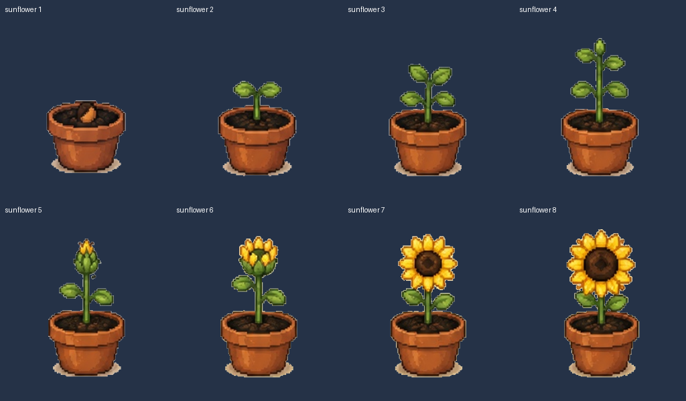
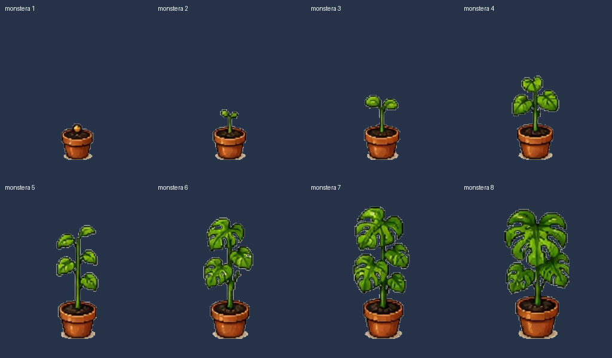

# Sprite correction and visual audit — 1.9.2

The 1.9.1 audit was insufficient: successful image decoding does not establish correct transparency, crop bounds, alignment, or fidelity to approved artwork. The reported sunflower sprout holes were real.

## Scope checked

- All **24 active growth stages**: Starter Flower, Sunflower, Monstera, eight stages each.
- All **12 active flower overlay definitions**, composed with their base at rest.
- All **39 distinct raster blobs** stored under `v1/assets/plants` across reachable Git history at release 1.9.1. Six failed decoding; the 33 decodable images were inspected in contact sheets. Historical commits were not rewritten.
- This is not a claim about every code-generated sprite in old JavaScript, uncommitted file, or image in older chats. Those are outside this tracked-raster inventory.
- The new user attachments approve Sunflower and plants 3–8. Only Monstera from the latter sheet is currently implemented. Lavender, Strawberry, Cactus, Cherry Blossom Bonsai and Pothos are not added by this repair.
- Starter Flower was checked against its existing repository artwork; no new approved Plant 1 source was supplied.

## Findings and corrections

| Finding | Correction |
| --- | --- |
| Sunflower sprout and other sunflower stages had transparent gaps inside the subject. | All eight stages now render the approved JPEG through explicit clipping masks. Dark pot, soil, stem and leaf pixels remain opaque. The original source colors are not quantized into a transparent palette entry. |
| Monstera stages included neighboring foliage, mismatched scales and a generated replacement in 1.9.1. | All eight stages now use the user's newly reattached approved concept art, with one baseline per species and crops restricted to each plant. The generated 1.9.1 replacement is removed from production. |
| More Flowers had a detached vertical line at source columns 122–123. | Its display mask excludes the line without altering the plant pixels. |
| Starter flower overlays used external-image SVG files and incorrect stage-7 regions. | Overlays now reference the intact raster inside inline SVG, with corrected clipping regions and transform origins. |
| Broken extractions remained available in the current tree. | Superseded sunflower/monstera PNGs and unused SVG overlays are removed; historical versions remain recoverable in Git. |

The two approved JPEG files are copied byte-for-byte into `v1/assets/plants/approved/`. `scripts/build-artwork-masks.py` produces **clipping metadata**, not replacement raster art. The renderer crops and masks the original pixels. No image generation is used in this correction.

Moisture filters, reduced-motion behavior, and 0/3/6/10 droplets in each of the two sizes remain. Only the designated flower overlay layers animate; the plant base stays static. Garden thumbnails and the garden detail view use the same artwork helper as the main plant card.

## Visual review sheets

These sheets were rendered from the production catalog and `artMarkup()` output, including overlays at their resting scale. They are static renderer checks, not browser screenshots.

## Validation and limits

- `node scripts/validate.mjs`: domain regressions, references, version/cache alignment, moisture/droplet behavior, image-container checks and simulated service-worker behavior.
- `python scripts/validate-images.py`: complete raster decoding, plus independent opacity checks at known interior points of the sunflower sprout's pot, stem and leaves.
- Static SVG rendering and visual inspection of all 24 compositions against the sources above.
- Source JPEG checksums match the user attachments.
- Browser preview access was previously rejected. No claim is made that iPhone Safari, live animation, or installed-PWA upgrade behavior has been tested on a device.

The approved sunflower board states **45 goal days**, while the existing app uses **36**. This visual repair preserves the existing progression thresholds to avoid changing users' earned progress. Any change to goal-day schedules should be decided separately.

See [historical raster inventory](docs/sprite-audit-1.9.2/historical-raster-inventory.json) for exact blob IDs and decode results.
